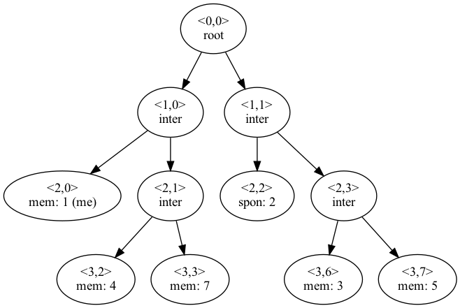

# Python Package: tgdhstruct
***Notice***: To see the command-line demo of this library, install via the `demo` branch.

This repo contains the source code and source distribution for **tgdhstruct**, a Python library that provides a tree structure to implement a Tree-based Group Diffie-Hellman (TGDH) encryption scheme.

## Installation
### Install Graphviz
#### MacOS
```
brew install graphviz
```
#### Linux
```
sudo apt install graphviz
```
### Install tgdhstruct
```
git clone https://github.com/John0b1000/tgdhstruct.git
```
```
python3 setup.py install
```
*Sudo permissions may be required (Errno 13). This issue may be caused by insufficient write permissions on `easy-install.pth` file.*
## Usage
Run the `network_demo` example from within the examples folder:
```
python3 network_demo.py <initial_size>
```
## Building Source Distribution
The source distribution file (sdist) can be built using the following command:
```
python3 setup.py sdist --formats=gztar
```
This library can then be installed using the `pip3` tool:
```
pip3 install <filename>.tar.gz
```
